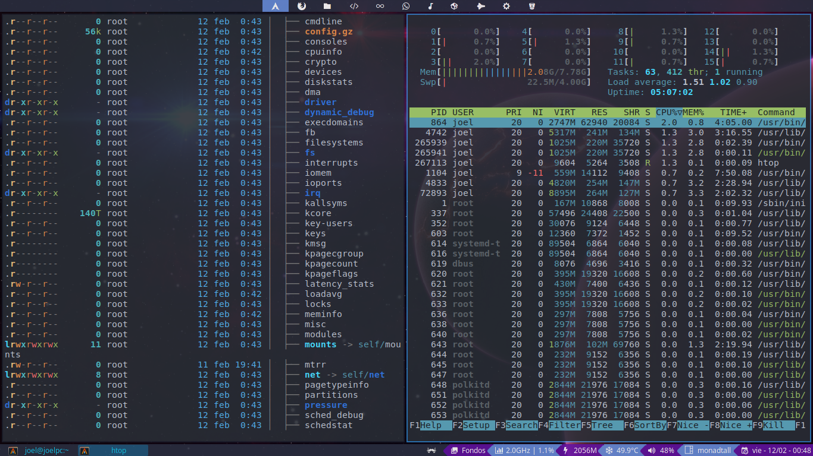

# dotfiles
All my config dotfiles.

This repository has all the config files that I have in my Arch Linux instalation. 

## It includes:
- The default windows manager is Qtile. It's really well configured.
- There is another windows manager installed, Fluxbox, which is a floating WM.
- The terminal is Alacritty.
- The text editors are Neovim and Sublime-text.
- The main aplicattion launcher is Dmenu. I also use dmenu_extended for some purposes.
- Rofi is installed too. It is useful for change windows, run some aplicattions and for Rofimoji.
- The default web browser is Brave Browser.
- The default file manager is Krusader. It is also configured PCmanFM.
- There are config files for lots of other apps.

## Adittional
- It is configured a special keyboard layout, a variation of the default latam layout. For that are the files "output.xkb" and ".Xmodmap".

## Screenshots

